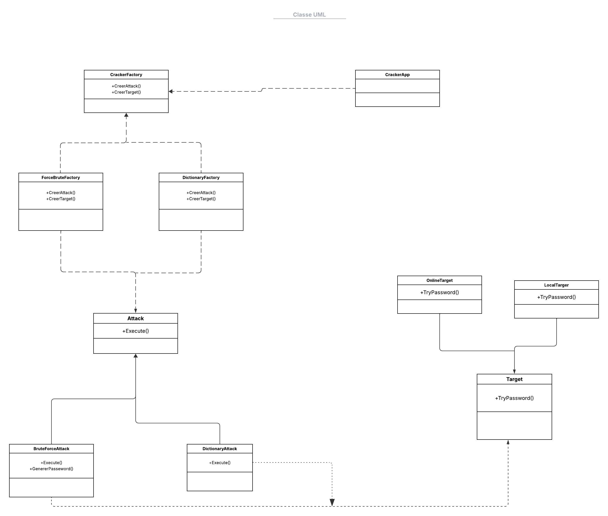

# Password-Cracker-Factory-
Implémentation de techniques de cassage de mots de passe via le patron de conception  « Fabrique »
# Plateforme Web de Gestion d'Examens avec Correction IA et Détection de Plagiat

## Rapport Succinct

Ce rapport présente une synthèse de l’architecture logicielle du projet, le choix des patrons de conception, les variantes implémentées et propose quelques pistes d’amélioration.

---

### 1. Architecture Logicielle

L’architecture du projet repose sur une structure MVC (Modèle-Vue-Contrôleur) afin de séparer les responsabilités :  
- **Modèle** : gestion des données des examens, utilisateurs, résultats et historique de corrections.  
- **Vue** : interface utilisateur web responsive, adaptée aux différents profils (étudiant, enseignant, administrateur).  
- **Contrôleur** : logique métier, gestion des flux (création d’examens, correction automatique, détection de plagiat).

#### Diagramme de Classes UML

>   
*(Insérer le diagramme UML du projet ici)*

---

### 2. Choix des Patrons de Conception

Nous avons privilégié plusieurs patrons pour répondre aux exigences du projet :

- **Singleton** : utilisé pour la gestion centralisée de la configuration de la plateforme et la connexion à la base de données, garantissant une instance unique tout au long du cycle de vie de l’application.
- **Factory** : pour la création flexible d’objets liés aux types d’examens ou de corrections (manuelle/automatique).
- **Strategy** : afin d’appliquer différentes méthodes de correction automatique selon la matière ou le type d’exercice.
- **Observer** : pour notifier automatiquement les utilisateurs (étudiants/enseignants) lors de la publication des résultats ou de la détection de plagiat.

#### Justification
Ces choix permettent :
- Une meilleure extensibilité et modularité,
- Une adaptation dynamique aux besoins métiers,
- Une gestion efficace des notifications et des processus automatisés.

---

### 3. Variantes Implémentées

- **Correction IA** : plusieurs algorithmes sont proposés (correction par mots-clés, par similarité sémantique, adaptation pour QCM ou réponses ouvertes).
- **Détection de Plagiat** : intégration de différentes variantes (comparaison textuelle, analyse sémantique, vérification par sources externes).
- **Gestion des rôles utilisateurs** : possibilité d’ajouter de nouveaux profils métiers sans impacter la structure existante.

---

### 4. Pistes d’Amélioration

- **Optimisation des algorithmes IA** : approfondir l’intégration de modèles de machine learning pour une correction plus fine.
- **Amélioration de l’UI/UX** : proposer une interface plus intuitive et accessible.
- **Extension du module de plagiat** : intégrer la vérification sur d’autres sources (Internet, publications académiques).
- **Internationalisation** : permettre la gestion multilingue de la plateforme.
- **Automatisation des rapports d’examen** : générer des synthèses automatiques pour les enseignants.

---

*Pour toute contribution ou suggestion, merci de créer une issue ou une pull request sur ce dépôt.*

